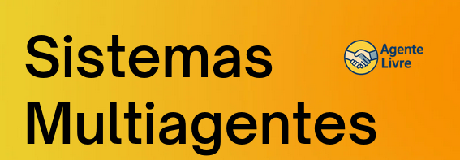

# Agente Livre




**Disciplina**: FGA0053 - Sistemas Multiagentes <br>
**Nro do Grupo (de acordo com a Planilha de Divisão dos Grupos)**: 01<br>
**Frente de Pesquisa**: Logística e cadeia de suprimentos<br>

## Alunos
| Matrícula  | Aluno                        |
| ---------- | ---------------------------- |
| 22/1007869 | Artur Henrique Holz Bartz    |
| 22/1022248 | Carlos Eduardo Mota Alves    |
| 19/0055201 | Matheus Calixto Vaz Pinheiro |
| 19/0115548 | Pedro Lucas Garcia           |
| 22/1008516 | Vitor Féijo Leonardo         |

## Sobre 
Nosso projeto é a implementação melroada em alugn pontos do artifo ()[], que não contém a implementação então nos propomos a implementar, mas basicamente é um sitam multi agente para determiarn o melhor fornecedor dado um conjto de fornecedores, ele utilza parametrso como precço, qualidade ... e vê a sinergia dos produtos coisa que outros artigos não tem e determina um fornecedor vencedor par um conjunto de produtos.

## Screenshots
Front web do sistema:


Jade:


## Instalação 
- **Linguagem:** Java 11 e Javascript
- **Tecnologias:** Maven,JADE e React.

Primeiro instale as dependências do projeto:

```bash
mvn install:install-file \
  -Dfile=lib/jade.jar \
  -DgroupId=com.tilab.jade \
  -DartifactId=jade \
  -Dversion=4.5.0 \
  -Dpackaging=jar
```

Em outro terminal:

```bash
cd mas-config-frontend
npm install
```

Depois, para construir o projeto, utilize o comando:

```bash
mvn clean package
```

```bash
npm run dev
```

Então , para executar o projeto, utilize o comando:

```bash
java -jar target/agentes-negociacao-1.0.0.jar
```

## Uso 
O uso é simples defini seus parametros e aguarde o vencedor.

## Vídeo
[Vídeo da apresentação](https://youtu.be/SEqmFE10yeE)


## Participações
Apresente, brevemente, como cada membro do grupo contribuiu para o projeto.
| Nome do Membro      | Contribuição                                                                            | Significância da Contribuição para o Projeto (Excelente/Boa/Regular/Ruim/Nula) | Comprobatórios (ex. links para commits)                                    |
| ------------------- | --------------------------------------------------------------------------------------- | ------------------------------------------------------------------------------ | -------------------------------------------------------------------------- |
| Artur Henrique Holz | Ajustes TDA e modelos iniciais                                                          | Excelente                                                                      | https://github.com/UnBSMA2025-2/G1_SMA_Behavior_LogisticaDeArmazens/pull/2 |
| Carlos Eduardo      | Implentacao inicial artigo, front end e documentação                                    | Excelente                                                                      | https://github.com/UnBSMA2025-2/G1_SMA_Behavior_LogisticaDeArmazens/pull/2 |
| Matheus Pinheiro    | organização e refatoracao, ajustes no algoritmo de winner e negociações e documentações | Excelente                                                                      | https://github.com/UnBSMA2025-2/G1_SMA_Behavior_LogisticaDeArmazens/pull/3 |
| Pedro Lucas Garcia  | Implementação do protocolo FIPA, lógica de contra proposta                              | Excelente                                                                      | https://github.com/UnBSMA2025-2/G1_SMA_Behavior_LogisticaDeArmazens/pull/1 |
| Vitor Feijó         | implementação artigo, ajustes comunicação e ajustes ambientação maven                   | Excelente                                                                      | https://github.com/UnBSMA2025-2/G1_SMA_Behavior_LogisticaDeArmazens/commit/22d776cf48ef5412e4e1180c06c42a8b1e490804                                                                           |

## Outros 
Quaisquer outras informações sobre o projeto podem ser descritas aqui. Não esqueça, entretanto, de informar sobre:
(i) Lições Aprendidas;
(ii) Percepções;
(iii) Contribuições e Fragilidades, e
(iV) Trabalhos Futuros.

## Fontes
Referencie, adequadamente, as referências utilizadas.
Indique ainda sobre fontes de leitura complementares.
